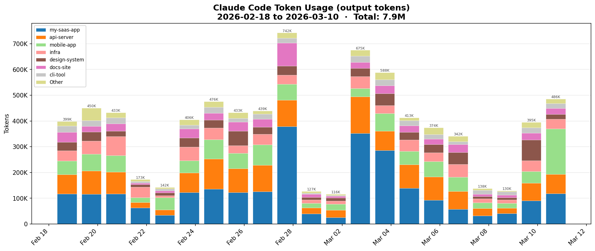

# Claude Code Usage Chart

Visualize your [Claude Code](https://claude.ai/claude-code) token usage broken down by day and project.



## Quick Start

```bash
# Clone
git clone https://github.com/gdilla/claude-usage-chart.git
cd claude-usage-chart

# Terminal chart (no dependencies needed)
python3 claude-usage-chart.py --terminal

# Graphical chart (requires matplotlib)
pip install matplotlib
python3 claude-usage-chart.py

# Or use uv to run without installing anything
uv run --with matplotlib python3 claude-usage-chart.py
```

## How It Works

Claude Code stores session transcripts as JSONL files in `~/.claude/projects/`. This script:

1. Scans all `~/.claude/projects/*/*.jsonl` files
2. Extracts token usage from assistant messages
3. Groups usage by day and project (worktrees are grouped with their parent project)
4. Renders a stacked bar chart

## Options

| Flag | Default | Description |
|------|---------|-------------|
| `--days N` | 30 | How far back to look |
| `--top N` | 8 | Top N projects by volume (rest grouped as "Other") |
| `--metric` | output | Token type: `output`, `input`, `total`, or `cache` |
| `--output PATH` | — | Save chart as PNG instead of displaying |
| `--terminal` | — | Force terminal chart (ANSI colored bars) |

## Examples

```bash
# Last 7 days, top 5 projects
python3 claude-usage-chart.py --days 7 --top 5

# Total tokens (input + output) for the last 2 weeks
python3 claude-usage-chart.py --days 14 --metric total

# Save to file
python3 claude-usage-chart.py --output usage.png
```

## Use as a Claude Code Slash Command

You can set this up as a `/burn` command so you (or your team) can type `/burn` inside any Claude Code session to instantly see a usage chart.

### Setup

1. Clone this repo somewhere on your machine:
   ```bash
   git clone https://github.com/gdilla/claude-usage-chart.git ~/projects/claude-usage-chart
   ```

2. Create the global commands directory (if it doesn't exist):
   ```bash
   mkdir -p ~/.claude/commands
   ```

3. Create `~/.claude/commands/burn.md` with this content:
   ```markdown
   Show my Claude Code token usage chart.

   ## Instructions

   Run the token usage chart script with these defaults, overridden by any arguments provided:

   ```
   uv run --with matplotlib python3 ~/projects/claude-usage-chart/claude-usage-chart.py --output /tmp/usage.png --days 30 $ARGUMENTS
   ```

   Then open the resulting PNG with `open /tmp/usage.png`.

   If the user passes arguments like `--days 7`, `--top 5`, `--metric total`, `--terminal`, etc.,
   append them to the command. If `--terminal` is passed, skip the `--output` flag and don't try
   to open a PNG.

   After running, briefly summarize what the chart shows (total tokens, top project, date range).
   ```

   > **Note:** If you don't have [uv](https://docs.astral.sh/uv/) installed, replace the `uv run --with matplotlib` prefix with just `python3` (and install matplotlib separately).

### Usage in Claude Code

```
/burn                          # 30-day chart, opens in Preview
/burn --days 7                 # last week
/burn --days 14 --top 5        # 2 weeks, top 5 projects
/burn --terminal               # quick terminal view, no image
/burn --metric total --days 7  # total tokens (input + output)
```

## Requirements

- **Python 3.9+** (uses only stdlib)
- **matplotlib** (optional — for graphical charts; falls back to terminal output)
- **uv** (optional — for running with matplotlib without installing it globally)

## License

MIT
